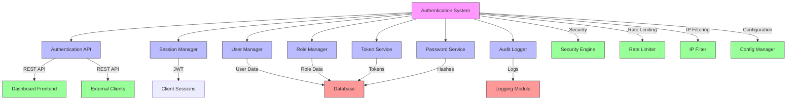
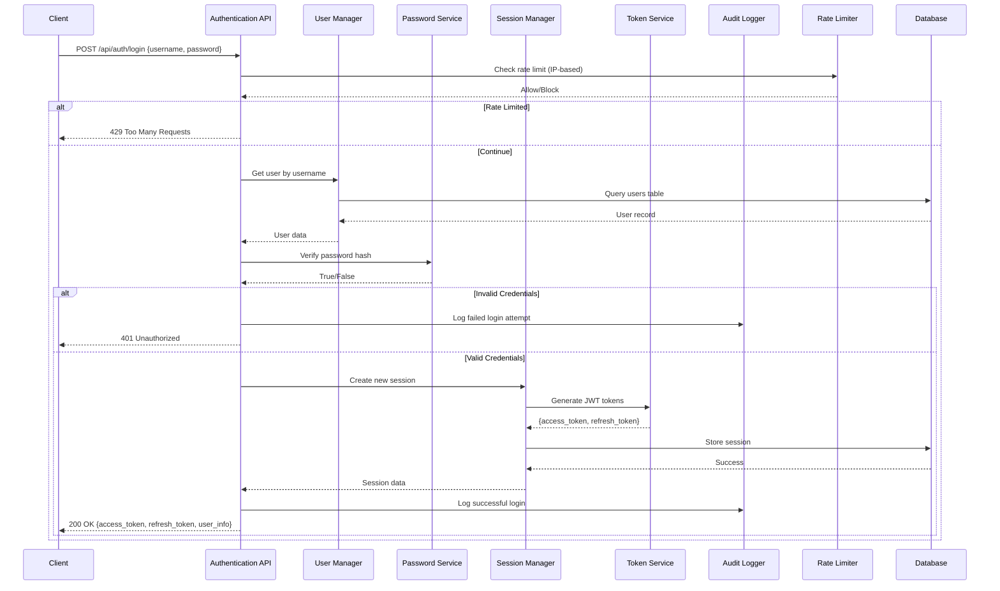
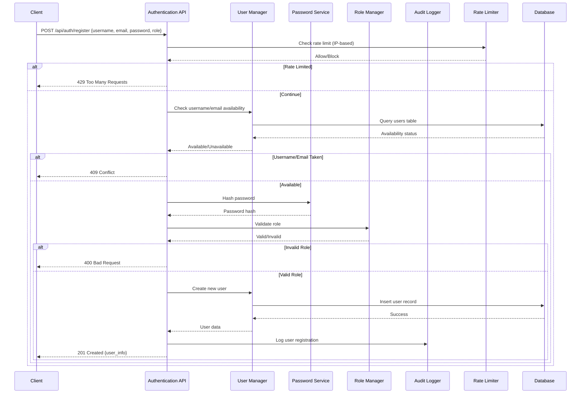
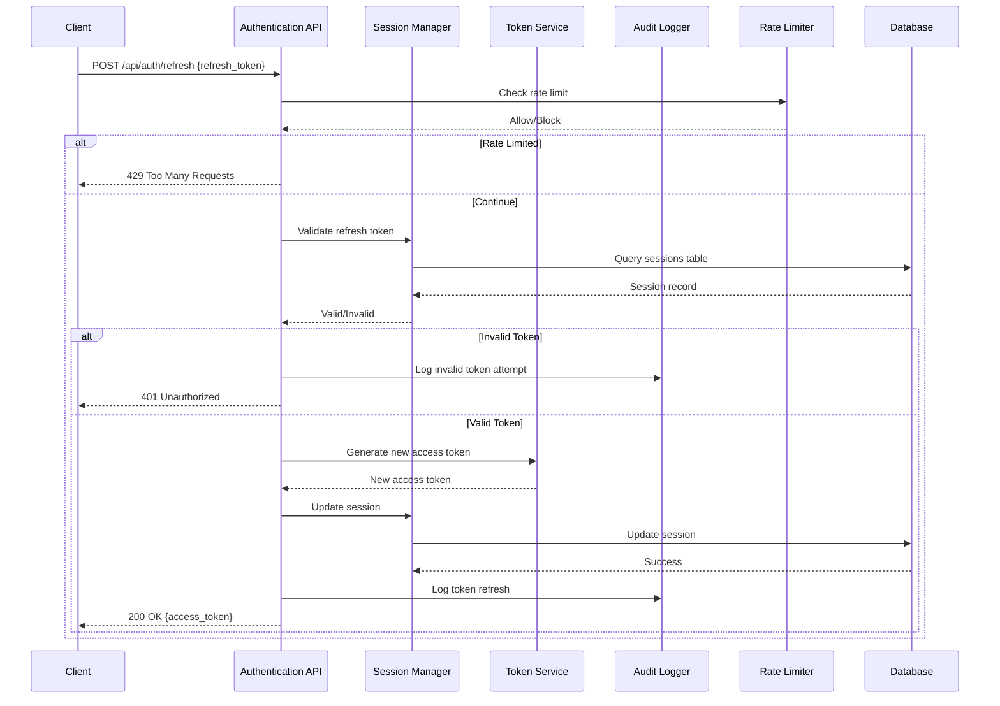
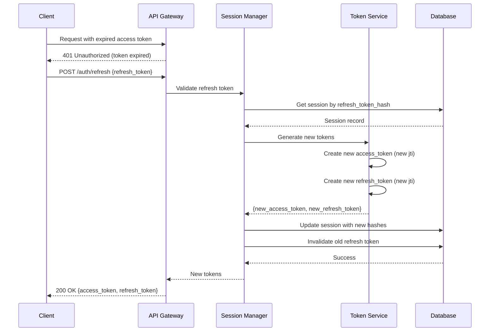
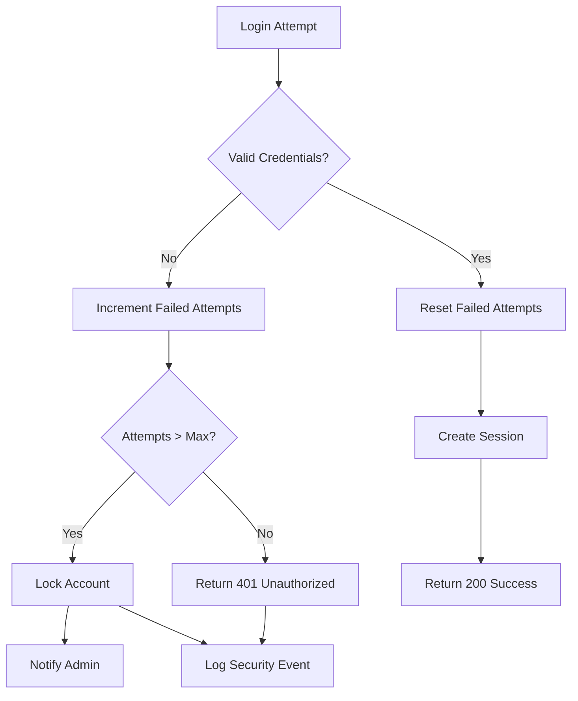
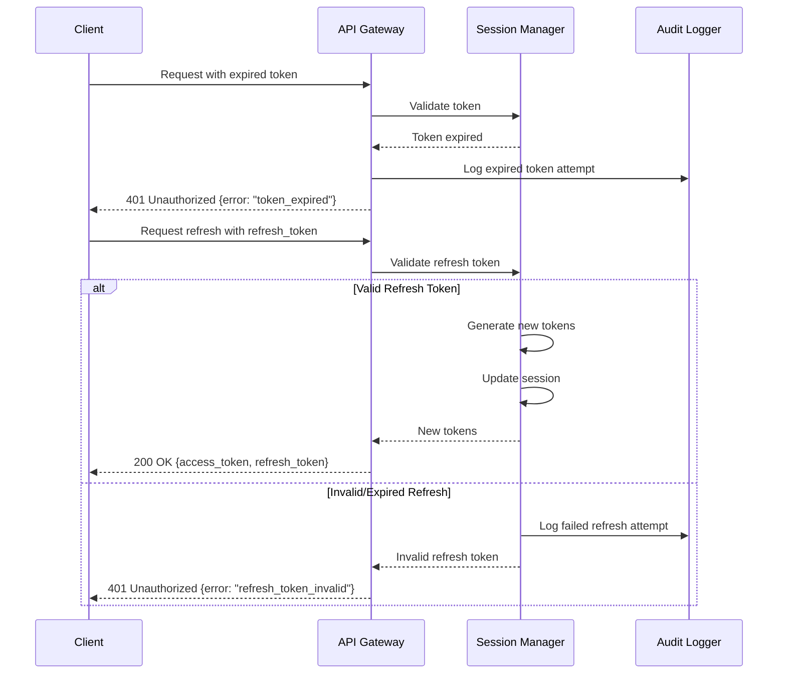
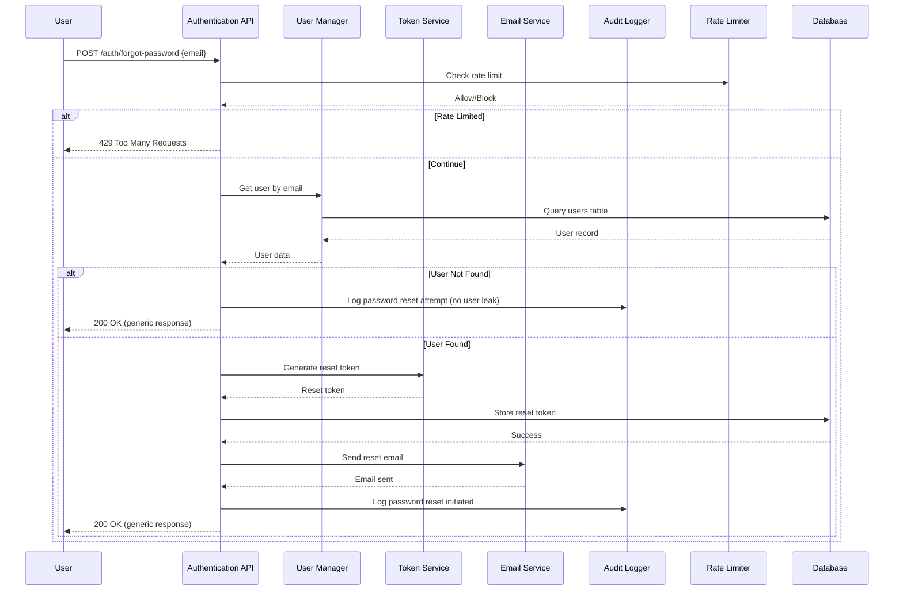
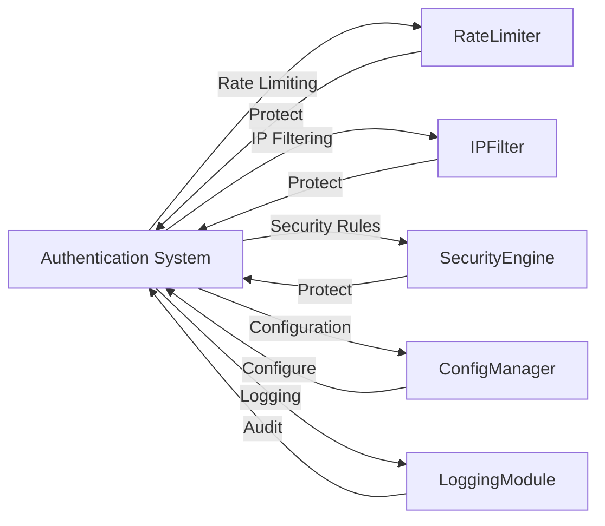
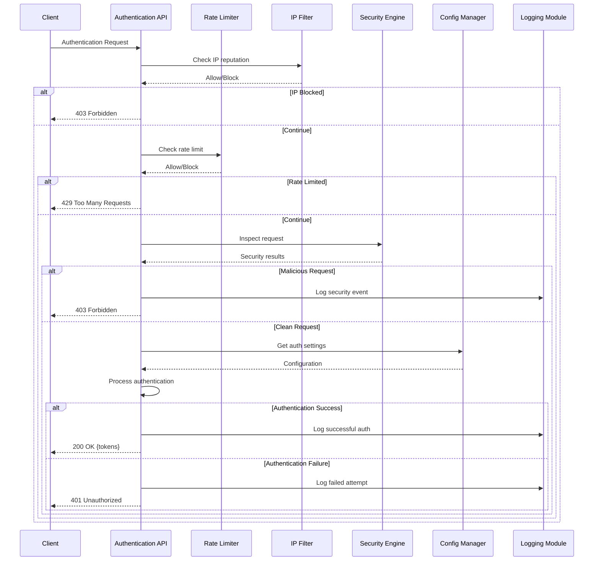

# Ariba WAF Authentication System Architecture

## 1. System Overview

This document presents the comprehensive authentication system architecture for the Ariba Web Application Firewall (WAF). The authentication system integrates with the existing WAF components and provides secure access control for the dashboard and API endpoints.

## 2. System Architecture Design

### 2.1 Component Diagram



### 2.2 Data Flow Diagrams

#### 2.2.1 Login Process



#### 2.2.2 Registration Process



#### 2.2.3 Session Management Process



## 3. Database Schema Design

### 3.1 Users Table

```sql
CREATE TABLE users (
    id SERIAL PRIMARY KEY,
    username VARCHAR(50) UNIQUE NOT NULL,
    email VARCHAR(255) UNIQUE NOT NULL,
    password_hash VARCHAR(255) NOT NULL,
    role VARCHAR(20) NOT NULL DEFAULT 'viewer',
    first_name VARCHAR(100),
    last_name VARCHAR(100),
    is_active BOOLEAN DEFAULT TRUE,
    is_locked BOOLEAN DEFAULT FALSE,
    failed_login_attempts INTEGER DEFAULT 0,
    last_login TIMESTAMP,
    created_at TIMESTAMP WITH TIME ZONE DEFAULT CURRENT_TIMESTAMP,
    updated_at TIMESTAMP WITH TIME ZONE DEFAULT CURRENT_TIMESTAMP,
    created_by INTEGER REFERENCES users(id),
    updated_by INTEGER REFERENCES users(id),
    CONSTRAINT valid_role CHECK (role IN ('super_admin', 'admin', 'viewer'))
);

CREATE INDEX idx_users_username ON users(username);
CREATE INDEX idx_users_email ON users(email);
CREATE INDEX idx_users_role ON users(role);
CREATE INDEX idx_users_is_active ON users(is_active);
```

### 3.2 Sessions Table

```sql
CREATE TABLE sessions (
    session_id UUID PRIMARY KEY,
    user_id INTEGER NOT NULL REFERENCES users(id) ON DELETE CASCADE,
    access_token_hash VARCHAR(255) NOT NULL,
    refresh_token_hash VARCHAR(255) NOT NULL,
    access_token_expires_at TIMESTAMP WITH TIME ZONE NOT NULL,
    refresh_token_expires_at TIMESTAMP WITH TIME ZONE NOT NULL,
    ip_address VARCHAR(45),
    user_agent TEXT,
    is_active BOOLEAN DEFAULT TRUE,
    created_at TIMESTAMP WITH TIME ZONE DEFAULT CURRENT_TIMESTAMP,
    last_used_at TIMESTAMP WITH TIME ZONE,
    revoked_at TIMESTAMP WITH TIME ZONE,
    revoked_by INTEGER REFERENCES users(id),
    revocation_reason TEXT
);

CREATE INDEX idx_sessions_user_id ON sessions(user_id);
CREATE INDEX idx_sessions_access_token_expires ON sessions(access_token_expires_at);
CREATE INDEX idx_sessions_refresh_token_expires ON sessions(refresh_token_expires_at);
CREATE INDEX idx_sessions_is_active ON sessions(is_active);
CREATE INDEX idx_sessions_ip_address ON sessions(ip_address);
```

### 3.3 Authentication Logs Table

```sql
CREATE TABLE authentication_logs (
    log_id SERIAL PRIMARY KEY,
    user_id INTEGER REFERENCES users(id),
    username VARCHAR(50),
    event_type VARCHAR(50) NOT NULL,
    event_timestamp TIMESTAMP WITH TIME ZONE DEFAULT CURRENT_TIMESTAMP,
    ip_address VARCHAR(45),
    user_agent TEXT,
    success BOOLEAN NOT NULL,
    details JSONB,
    metadata JSONB
);

CREATE INDEX idx_auth_logs_user_id ON authentication_logs(user_id);
CREATE INDEX idx_auth_logs_username ON authentication_logs(username);
CREATE INDEX idx_auth_logs_event_type ON authentication_logs(event_type);
CREATE INDEX idx_auth_logs_event_timestamp ON authentication_logs(event_timestamp);
CREATE INDEX idx_auth_logs_ip_address ON authentication_logs(ip_address);
CREATE INDEX idx_auth_logs_success ON authentication_logs(success);
```

### 3.4 Password Reset Tokens Table

```sql
CREATE TABLE password_reset_tokens (
    token_id SERIAL PRIMARY KEY,
    user_id INTEGER NOT NULL REFERENCES users(id) ON DELETE CASCADE,
    token_hash VARCHAR(255) NOT NULL,
    expires_at TIMESTAMP WITH TIME ZONE NOT NULL,
    used BOOLEAN DEFAULT FALSE,
    used_at TIMESTAMP WITH TIME ZONE,
    created_at TIMESTAMP WITH TIME ZONE DEFAULT CURRENT_TIMESTAMP,
    created_by INTEGER REFERENCES users(id)
);

CREATE INDEX idx_password_reset_tokens_user_id ON password_reset_tokens(user_id);
CREATE INDEX idx_password_reset_tokens_token_hash ON password_reset_tokens(token_hash);
CREATE INDEX idx_password_reset_tokens_expires_at ON password_reset_tokens(expires_at);
CREATE INDEX idx_password_reset_tokens_used ON password_reset_tokens(used);
```

### 3.5 Roles and Permissions Tables

```sql
CREATE TABLE roles (
    role_id SERIAL PRIMARY KEY,
    role_name VARCHAR(50) UNIQUE NOT NULL,
    description TEXT,
    is_system_role BOOLEAN DEFAULT FALSE,
    created_at TIMESTAMP WITH TIME ZONE DEFAULT CURRENT_TIMESTAMP,
    updated_at TIMESTAMP WITH TIME ZONE DEFAULT CURRENT_TIMESTAMP
);

CREATE TABLE permissions (
    permission_id SERIAL PRIMARY KEY,
    permission_name VARCHAR(100) UNIQUE NOT NULL,
    description TEXT,
    category VARCHAR(50),
    created_at TIMESTAMP WITH TIME ZONE DEFAULT CURRENT_TIMESTAMP,
    updated_at TIMESTAMP WITH TIME ZONE DEFAULT CURRENT_TIMESTAMP
);

CREATE TABLE role_permissions (
    role_id INTEGER NOT NULL REFERENCES roles(role_id) ON DELETE CASCADE,
    permission_id INTEGER NOT NULL REFERENCES permissions(permission_id) ON DELETE CASCADE,
    created_at TIMESTAMP WITH TIME ZONE DEFAULT CURRENT_TIMESTAMP,
    created_by INTEGER REFERENCES users(id),
    PRIMARY KEY (role_id, permission_id)
);

CREATE INDEX idx_role_permissions_role_id ON role_permissions(role_id);
CREATE INDEX idx_role_permissions_permission_id ON role_permissions(permission_id);
```

## 4. Security Architecture

### 4.1 Password Hashing Strategy

```python
# Password hashing using bcrypt with work factor 12
import bcrypt

def hash_password(password: str) -> str:
    """
    Hash password using bcrypt with work factor 12
    """
    salt = bcrypt.gensalt(rounds=12)
    hashed = bcrypt.hashpw(password.encode('utf-8'), salt)
    return hashed.decode('utf-8')

def verify_password(password: str, hashed_password: str) -> bool:
    """
    Verify password against bcrypt hash
    """
    return bcrypt.checkpw(password.encode('utf-8'), hashed_password.encode('utf-8'))
```

**Security Considerations:**
- **Work Factor**: bcrypt with rounds=12 provides strong security while maintaining reasonable performance
- **Salt**: Automatic salt generation prevents rainbow table attacks
- **Future-proof**: Work factor can be increased as hardware improves
- **Migration**: Supports gradual migration to stronger hashing algorithms

### 4.2 Session Management Approach

**JWT vs Server-side Sessions Decision:**

| Aspect | JWT Approach | Server-side Sessions | Decision |
|--------|-------------|----------------------|----------|
| **Security** | Signed tokens, stateless | Server-controlled, stateful | Hybrid |
| **Scalability** | Excellent, no server state | Requires session storage | Hybrid |
| **Performance** | No database lookups | Requires session validation | Hybrid |
| **Token Revocation** | Difficult (requires blacklist) | Easy (delete session) | Hybrid |
| **Implementation** | Simple client-side | Requires session management | Hybrid |

**Hybrid Approach:**
- **Short-lived JWT access tokens** (15-30 minutes) for API authentication
- **Server-side refresh tokens** with longer expiration (7-30 days)
- **Session database records** for tracking and revocation
- **Token rotation** on each refresh to prevent replay attacks

### 4.3 Token Rotation and Refresh Strategy



### 4.4 Secure Cookie Configuration

```nginx
# Secure cookie configuration for web sessions
location / {
    proxy_cookie_path / "/; Secure; HttpOnly; SameSite=Lax";
    proxy_set_header Cookie $http_cookie;
}

# JWT cookie settings (for web applications)
Set-Cookie: access_token=eyJhbGciOiJIUzI1NiIsInR5cCI6IkpXVCJ9...;
    Path=/;
    Secure;
    HttpOnly;
    SameSite=Lax;
    Max-Age=1800; # 30 minutes

Set-Cookie: refresh_token=eyJhbGciOiJIUzI1NiIsInR5cCI6IkpXVCJ9...;
    Path=/auth;
    Secure;
    HttpOnly;
    SameSite=Lax;
    Max-Age=2592000; # 30 days
```

**Security Headers:**
```
Strict-Transport-Security: max-age=63072000; includeSubDomains; preload
X-Content-Type-Options: nosniff
X-Frame-Options: DENY
X-XSS-Protection: 1; mode=block
Content-Security-Policy: default-src 'self'; script-src 'self' 'unsafe-inline' cdn.example.com; style-src 'self' 'unsafe-inline' cdn.example.com; img-src 'self' data: cdn.example.com; font-src 'self' cdn.example.com; connect-src 'self' api.example.com; frame-src 'none'; object-src 'none'
Referrer-Policy: strict-origin-when-cross-origin
```

## 5. Role-Based Access Control Design

### 5.1 Permission Matrix

| Role | Dashboard Access | Rule Management | IP Management | Rate Limiting | User Management | System Settings | Audit Logs | API Access |
|------|------------------|-----------------|---------------|---------------|-----------------|-----------------|------------|------------|
| **Super Admin** | Full | Full (CRUD) | Full (CRUD) | Full (CRUD) | Full (CRUD) | Full (CRUD) | Full | Full |
| **Admin** | Full | Read/Update | Read/Update | Read/Update | Read/Update | Read | Read | Read/Write |
| **Viewer** | Read-only | Read-only | Read-only | Read-only | Read-only | None | Read | Read-only |

### 5.2 Permission Categories and Examples

**Dashboard Permissions:**
- `dashboard:view` - View dashboard pages
- `dashboard:edit` - Edit dashboard settings
- `dashboard:export` - Export dashboard data

**Rule Management Permissions:**
- `rules:view` - View security rules
- `rules:create` - Create new rules
- `rules:edit` - Edit existing rules
- `rules:delete` - Delete rules
- `rules:test` - Test rule patterns

**IP Management Permissions:**
- `ip:view` - View IP lists
- `ip:add` - Add IPs to lists
- `ip:remove` - Remove IPs from lists
- `ip:import` - Bulk import IPs
- `ip:export` - Export IP lists

**User Management Permissions:**
- `users:view` - View user list
- `users:create` - Create new users
- `users:edit` - Edit user profiles
- `users:delete` - Delete users
- `users:roles` - Manage user roles

### 5.3 API and UI Level Enforcement

**API Level Enforcement:**
```python
def check_permission(user_id: int, permission: str) -> bool:
    """
    Check if user has specific permission
    """
    # Get user's roles
    roles = get_user_roles(user_id)

    # Check each role for the permission
    for role in roles:
        if has_permission(role, permission):
            return True

    return False

def has_permission(role: str, permission: str) -> bool:
    """
    Check if role has specific permission
    """
    # Query role_permissions table
    return db.query(
        "SELECT 1 FROM role_permissions rp "
        "JOIN permissions p ON rp.permission_id = p.permission_id "
        "JOIN roles r ON rp.role_id = r.role_id "
        "WHERE r.role_name = %s AND p.permission_name = %s",
        (role, permission)
    ).fetchone() is not None
```

**UI Level Enforcement:**
```javascript
// Vue.js permission directive
Vue.directive('permission', {
    inserted(el, binding) {
        const userPermissions = store.state.user.permissions;
        const requiredPermission = binding.value;

        if (!userPermissions.includes(requiredPermission)) {
            el.parentNode && el.parentNode.removeChild(el);
        }
    }
});

// Usage in templates
<button v-permission="'rules:create'" @click="createRule">Create Rule</button>
<router-link v-permission="'users:view'" to="/users">User Management</router-link>
```

## 6. Error Handling and Recovery

### 6.1 Failed Login Handling



**Account Lockout Policy:**
- **Max Failed Attempts**: 5 attempts within 15 minutes
- **Lockout Duration**: 30 minutes or until admin unlocks
- **Notification**: Email alert to security team
- **Recovery**: Manual unlock by admin or wait for timeout

### 6.2 Session Expiration Handling



### 6.3 Password Recovery Process



## 7. Integration with Existing WAF Components

### 7.1 Integration Points



### 7.2 Security Integration Flow



## 8. Implementation Roadmap

### 8.1 Phase 1: Core Authentication (2-3 weeks)
- [ ] Design and implement database schema
- [ ] Create password hashing service
- [ ] Implement JWT token service
- [ ] Build session management system
- [ ] Develop basic authentication API endpoints

### 8.2 Phase 2: Security Integration (1-2 weeks)
- [ ] Integrate with Rate Limiter for login protection
- [ ] Integrate with IP Filter for brute force prevention
- [ ] Add Security Engine inspection for auth requests
- [ ] Implement comprehensive logging and auditing

### 8.3 Phase 3: RBAC System (2 weeks)
- [ ] Design and implement roles and permissions
- [ ] Create permission matrix and enforcement
- [ ] Develop admin interface for role management
- [ ] Implement API-level permission checks

### 8.4 Phase 4: Dashboard Integration (1-2 weeks)
- [ ] Add authentication to dashboard frontend
- [ ] Implement protected routes and components
- [ ] Add user profile management
- [ ] Create admin dashboard for user management

### 8.5 Phase 5: Testing and Optimization (1 week)
- [ ] Security penetration testing
- [ ] Performance optimization
- [ ] Load testing
- [ ] User acceptance testing

## 9. Security Best Practices

### 9.1 Authentication Security Checklist
- [x] Use bcrypt for password hashing (work factor 12)
- [x] Implement rate limiting for login endpoints
- [x] Use short-lived access tokens (15-30 minutes)
- [x] Implement token rotation on refresh
- [x] Store only token hashes in database
- [x] Use secure, HttpOnly cookies for web sessions
- [x] Implement CSRF protection
- [x] Enforce strong password policies
- [x] Implement account lockout after failed attempts
- [x] Log all authentication events for auditing

### 9.2 API Security Checklist
- [x] Use HTTPS/TLS for all communications
- [x] Implement proper CORS configuration
- [x] Validate all input data
- [x] Use parameterized queries to prevent SQL injection
- [x] Implement proper error handling (no stack traces)
- [x] Use security headers
- [x] Implement request size limits
- [x] Use content security policies
- [x] Implement proper session invalidation

## 10. Monitoring and Maintenance

### 10.1 Key Metrics to Monitor
- **Authentication Success Rate**: Percentage of successful logins
- **Failed Login Attempts**: Number of failed login attempts
- **Account Lockouts**: Number of locked accounts
- **Token Refresh Rate**: Frequency of token refreshes
- **Session Duration**: Average session length
- **Concurrent Sessions**: Number of active sessions per user
- **API Response Times**: Authentication endpoint performance
- **Rate Limit Events**: Number of rate-limited requests

### 10.2 Alerting Thresholds
- **Failed Login Alert**: >10 failed attempts in 5 minutes from single IP
- **Brute Force Alert**: >50 failed attempts in 1 hour from single IP
- **Account Lockout Alert**: >5 accounts locked in 1 hour
- **Token Flood Alert**: >100 token refreshes in 1 minute from single user
- **Session Anomaly Alert**: Multiple concurrent sessions from different IPs
- **Performance Alert**: Authentication response time > 500ms

This comprehensive authentication system architecture provides a secure, scalable foundation for the Ariba WAF dashboard and API access control. The design integrates seamlessly with existing WAF components while providing robust security features and flexible role-based access control.