# Ariba WAF Dashboard Architecture Design

## 1. Comprehensive Component Architecture

```mermaid
graph TD
    A[Dashboard App] --> B[Core Layout]
    A --> C[Navigation System]
    A --> D[Data Services]
    A --> E[State Management]

    B --> B1[MainLayout]
    B --> B2[Sidebar]
    B --> B3[Header]
    B --> B4[Footer]
    B --> B5[ResponsiveGrid]

    C --> C1[SidebarNavigation]
    C --> C2[Breadcrumb]
    C --> C3[QuickAccessMenu]

    D --> D1[ApiService]
    D --> D2[WebSocketService]
    D --> D3[DataTransformer]
    D --> D4[CacheManager]

    E --> E1[GlobalState]
    E --> E2[ModuleState]
    E --> E3[LocalState]

    %% Main Dashboard Modules
    A --> F[DashboardOverview]
    A --> G[LiveTraffic]
    A --> H[BlockedRequests]
    A --> I[RuleManagement]
    A --> J[IPManagement]
    A --> K[RateLimiting]
    A --> L[LogsReports]
    A --> M[Settings]

    %% Dashboard Overview Components
    F --> F1[SummaryCards]
    F --> F2[TrafficChart]
    F --> F3[ThreatMap]
    F --> F4[SystemHealth]
    F --> F5[RecentAlerts]

    %% Live Traffic Components
    G --> G1[LiveRequestFeed]
    G --> G2[TrafficTimeline]
    G --> G3[RequestDetailsPanel]
    G --> G4[FilterControls]

    %% Blocked Requests Components
    H --> H1[BlockedRequestsTable]
    H --> H2[AttackTypeChart]
    H --> H3[IPAnalysis]
    H --> H4[ExportOptions]

    %% Rule Management Components
    I --> I1[RulesTable]
    I --> I2[RuleEditor]
    I --> I3[RuleConflictDetector]
    I --> I4[RuleTesting]

    %% IP Management Components
    J --> J1[IPLists]
    J --> J2[IPMapVisualization]
    J --> J3[IPDetails]
    J --> J4[BulkImport]

    %% Rate Limiting Components
    K --> K1[RateLimitRules]
    K --> K2[TrafficPatterns]
    K --> K3[EndpointAnalysis]
    K --> K4[RateLimitTesting]

    %% Logs & Reports Components
    L --> L1[LogViewer]
    L --> L2[LogFilters]
    L --> L3[ReportGenerator]
    L --> L4[ExportManager]

    %% Settings Components
    M --> M1[UserSettings]
    M --> M2[SystemSettings]
    M --> M3[NotificationSettings]
    M --> M4[APISettings]

    %% Backend Integration
    D1 --> N[WAF Backend API]
    D2 --> O[WebSocket Server]

    %% Styling
    style A fill:#f9f,stroke:#333
    style B fill:#bbf,stroke:#333
    style C fill:#bbf,stroke:#333
    style D fill:#bbf,stroke:#333
    style E fill:#bbf,stroke:#333
    style F fill:#9f9,stroke:#333
    style G fill:#9f9,stroke:#333
    style H fill:#9f9,stroke:#333
    style I fill:#9f9,stroke:#333
    style J fill:#9f9,stroke:#333
    style K fill:#9f9,stroke:#333
    style L fill:#9f9,stroke:#333
    style M fill:#9f9,stroke:#333
```

## 2. Detailed Wireframes

### 2.1 Dashboard Overview Page
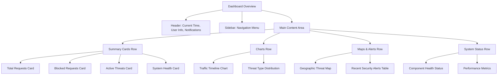

### 2.2 Live Traffic Page
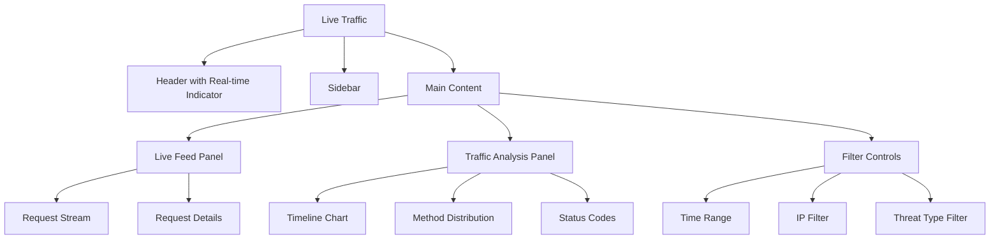

### 2.3 Blocked Requests Page
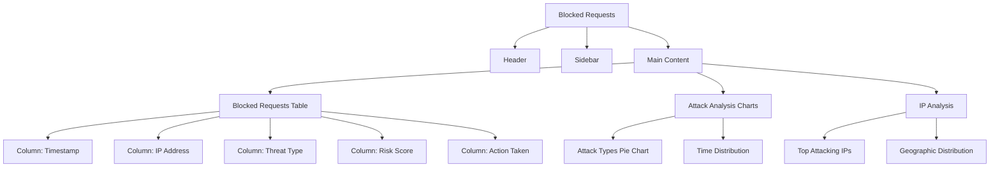

### 2.4 Rule Management Page
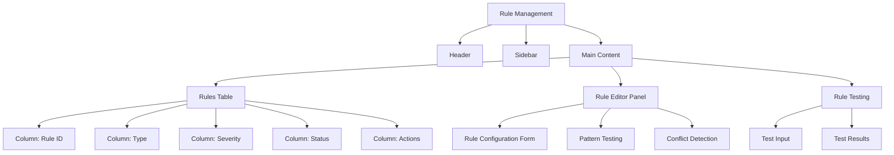

### 2.5 IP Management Page
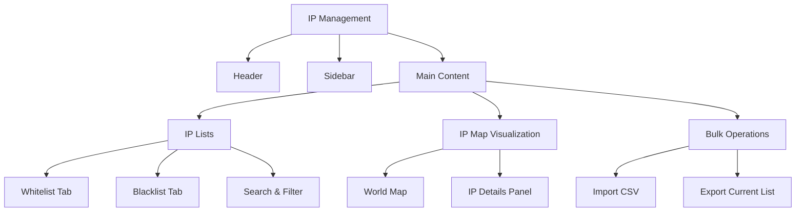

### 2.6 Rate Limiting Page
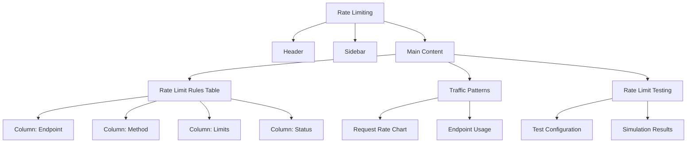

### 2.7 Logs & Reports Page
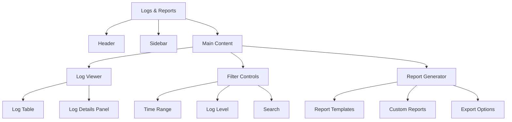

### 2.8 Settings Page
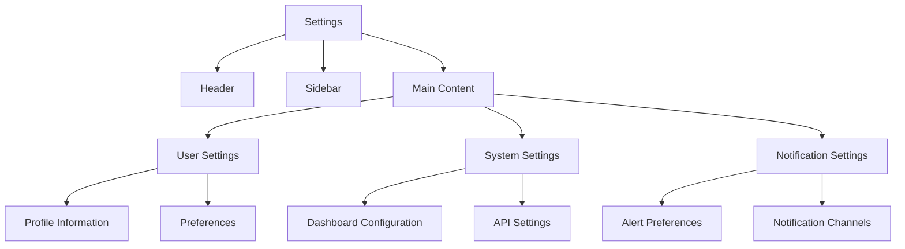

## 3. Responsive Layout Design

### 3.1 Desktop Layout (1200px+)
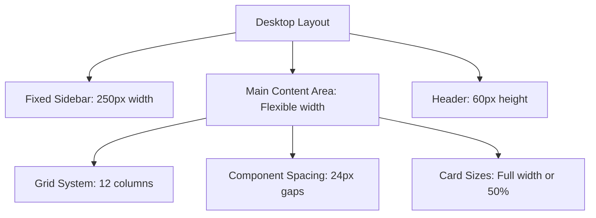

### 3.2 Tablet Layout (768px-1199px)
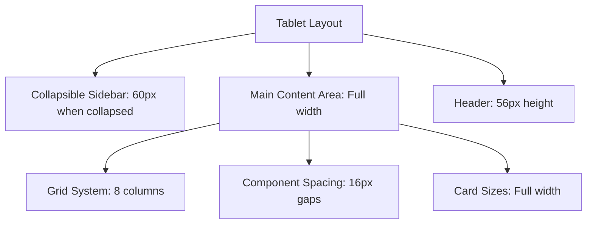

### 3.3 Responsive Breakpoints
- **Desktop**: ≥1200px
- **Large Tablet**: 1024px-1199px
- **Tablet**: 768px-1023px
- **Mobile**: <768px (not supported in initial scope)

## 4. Technical Specifications

### 4.1 Component Data Requirements

#### Dashboard Overview
- **Inputs**: Real-time traffic data, threat statistics, system health
- **Outputs**: Visualized metrics, alerts
- **API Endpoints**: `/api/monitoring/live-traffic`, `/api/monitoring/attack-stats`, `/api/monitoring/system-health`
- **State**: Current time range, selected metrics
- **User Flows**: View summary → Drill down to details → Export data

#### Live Traffic
- **Inputs**: Live request stream, historical traffic data
- **Outputs**: Real-time feed, traffic charts
- **API Endpoints**: `/api/monitoring/live-traffic`, `/ws/realtime-updates`
- **State**: Current filters, selected request details
- **User Flows**: Monitor live traffic → Filter requests → View details

#### Blocked Requests
- **Inputs**: Blocked request logs, attack patterns
- **Outputs**: Blocked requests table, attack analysis
- **API Endpoints**: `/api/logs/security`, `/api/analytics/threats`
- **State**: Time range, attack type filters
- **User Flows**: View blocked requests → Analyze patterns → Export data

#### Rule Management
- **Inputs**: Security rules, rule templates
- **Outputs**: Rules table, rule editor
- **API Endpoints**: `/api/config/rules`, `/api/config/rules/{id}`
- **State**: Current rule being edited, conflict detection
- **User Flows**: View rules → Edit rule → Test rule → Save

#### IP Management
- **Inputs**: IP lists, geographic data
- **Outputs**: IP tables, map visualization
- **API Endpoints**: `/api/config/ip-filter`, `/api/analytics/ip-analysis`
- **State**: Current IP list, selected IP details
- **User Flows**: View IP lists → Add/remove IPs → Bulk operations

#### Rate Limiting
- **Inputs**: Rate limit rules, traffic patterns
- **Outputs**: Rules table, traffic charts
- **API Endpoints**: `/api/config/rate-limits`, `/api/analytics/traffic-patterns`
- **State**: Current rate limit configuration
- **User Flows**: View limits → Configure limits → Test configuration

#### Logs & Reports
- **Inputs**: Log data, report templates
- **Outputs**: Log viewer, reports
- **API Endpoints**: `/api/logs/requests`, `/api/logs/export`
- **State**: Current filters, selected log entries
- **User Flows**: Search logs → Generate reports → Export data

#### Settings
- **Inputs**: User preferences, system configuration
- **Outputs**: Settings forms
- **API Endpoints**: `/api/settings/user`, `/api/settings/system`
- **State**: Current settings values
- **User Flows**: View settings → Update settings → Save

## 5. File Structure for Frontend Implementation

```
src/
├── assets/
│   ├── images/
│   ├── icons/
│   └── styles/
├── components/
│   ├── common/
│   │   ├── Button.vue
│   │   ├── Card.vue
│   │   ├── Chart.vue
│   │   ├── Table.vue
│   │   └── ...
│   ├── layout/
│   │   ├── MainLayout.vue
│   │   ├── Sidebar.vue
│   │   ├── Header.vue
│   │   └── Footer.vue
│   └── modules/
│       ├── dashboard/
│       ├── traffic/
│       ├── blocked/
│       ├── rules/
│       ├── ip/
│       ├── rate/
│       ├── logs/
│       └── settings/
├── services/
│   ├── api/
│   │   ├── index.js
│   │   ├── monitoring.js
│   │   ├── config.js
│   │   ├── logs.js
│   │   └── analytics.js
│   ├── websocket/
│   │   └── realtime.js
│   └── cache/
│       └── cacheManager.js
├── store/
│   ├── modules/
│   │   ├── auth.js
│   │   ├── dashboard.js
│   │   ├── traffic.js
│   │   └── ...
│   └── index.js
├── utils/
│   ├── dataTransformers.js
│   ├── validators.js
│   └── helpers.js
├── views/
│   ├── DashboardOverview.vue
│   ├── LiveTraffic.vue
│   ├── BlockedRequests.vue
│   ├── RuleManagement.vue
│   ├── IPManagement.vue
│   ├── RateLimiting.vue
│   ├── LogsReports.vue
│   └── Settings.vue
├── router/
│   └── index.js
├── App.vue
└── main.js
```

## 6. Integration Points with Backend WAF Components

### 6.1 API Gateway Integration
- **Component**: `api_gateway.py`
- **Purpose**: Central endpoint for all dashboard API requests
- **Integration**: RESTful endpoints mapping to WAF components

### 6.2 Real-time Data Integration
- **Component**: WebSocket server
- **Purpose**: Push real-time updates to dashboard
- **Integration**: Event-driven architecture with WAF components

### 6.3 Component-specific Integrations

#### Request Handler Integration
- **Endpoints**: `/api/monitoring/live-traffic`
- **Data**: Request metadata, processing times, status
- **Integration**: Direct access to request handler data

#### Security Engine Integration
- **Endpoints**: `/api/monitoring/attack-stats`, `/api/config/rules`
- **Data**: Threat detection patterns, rule configurations
- **Integration**: Security rule management and threat analysis

#### Logging Module Integration
- **Endpoints**: `/api/logs/*`
- **Data**: Request logs, security events, system events
- **Integration**: Comprehensive log access and filtering

#### Rate Limiter Integration
- **Endpoints**: `/api/config/rate-limits`, `/api/monitoring/rate-limit-status`
- **Data**: Rate limit configurations, token bucket status
- **Integration**: Rate limit management and monitoring

#### IP Filter Integration
- **Endpoints**: `/api/config/ip-filter`, `/api/analytics/ip-analysis`
- **Data**: IP lists, access patterns
- **Integration**: IP management and geographic analysis

#### Config Manager Integration
- **Endpoints**: `/api/config/rules`
- **Data**: Security rules, configuration history
- **Integration**: Centralized rule management

## 7. High-Fidelity Mockup Specifications

### 7.1 Collapsible Sidebar Navigation
- **Width**: 250px expanded, 60px collapsed
- **Items**: Dashboard, Live Traffic, Blocked Requests, Rule Management, IP Management, Rate Limiting, Logs & Reports, Settings
- **Features**: Active state highlighting, hover effects, responsive collapse

### 7.2 Main Dashboard Layout
- **Header**: 60px height, user info, notifications, time display
- **Content Area**: Grid-based layout with responsive cards
- **Cards**: Shadow effects, hover states, expandable details

### 7.3 Chart Components
- **Traffic Chart**: Line chart with time series data
- **Threat Map**: Geographic heatmap with attack origins
- **Attack Type Chart**: Pie/donut chart for threat distribution
- **Features**: Interactive tooltips, zoom capabilities, export options

### 7.4 Table Components
- **Logs Table**: Paginated table with sorting and filtering
- **Rules Table**: Editable table with inline actions
- **IP Table**: Searchable table with bulk operations
- **Features**: Column resizing, multi-select, export to CSV/JSON

### 7.5 Form Components
- **Rule Editor**: Multi-step form with pattern testing
- **IP Management**: Bulk upload form with validation
- **Rate Limit Config**: Slider-based configuration with preview
- **Features**: Real-time validation, inline help, save drafts

## 8. Implementation Roadmap

1. **Phase 1**: Setup frontend framework and core layout
2. **Phase 2**: Implement API services and state management
3. **Phase 3**: Build core dashboard views and components
4. **Phase 4**: Integrate with backend API endpoints
5. **Phase 5**: Implement real-time WebSocket updates
6. **Phase 6**: Add advanced features and optimizations
7. **Phase 7**: Testing and performance optimization
8. **Phase 8**: Deployment and monitoring setup

## 9. Performance Optimization Strategies

- **Data Caching**: Implement intelligent caching for frequently accessed data
- **Lazy Loading**: Load components and data on-demand
- **Pagination**: Implement server-side pagination for large datasets
- **Web Workers**: Use web workers for data processing
- **Debouncing**: Optimize search and filter operations

## 10. Security Considerations

- **Authentication**: JWT-based authentication for all API requests
- **Authorization**: Role-based access control (Admin, Analyst, Viewer)
- **Data Validation**: Client-side and server-side validation
- **Secure Storage**: Encrypted storage for sensitive data
- **Audit Logging**: Comprehensive logging of user actions

This architecture provides a comprehensive blueprint for the Ariba WAF dashboard, covering all required components, their relationships, technical specifications, and integration points with the backend WAF system.