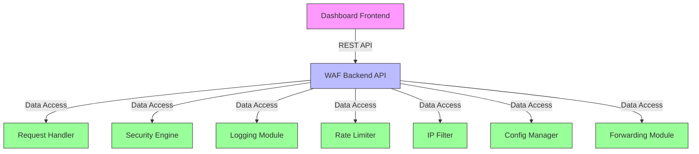
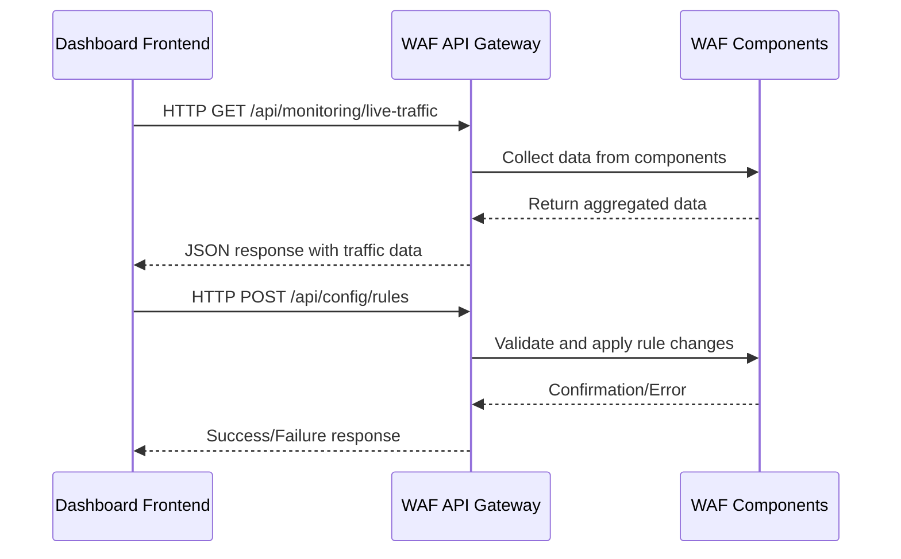
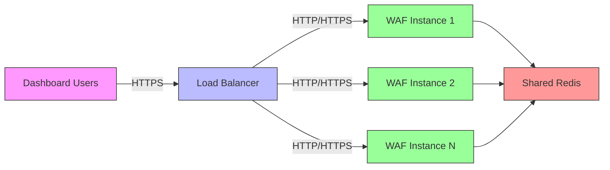

# Ariba WAF Dashboard Integration Technical Specification

## 1. Overview

This document specifies the integration architecture for connecting the Ariba WAF dashboard to the backend WAF components. The dashboard will provide real-time monitoring, configuration management, and analytics capabilities.

## 2. WAF Core Components Analysis

Based on the codebase analysis, the Ariba WAF consists of the following key components:

### 2.1 Request Handler (`request_handler.py`)
- **Function**: Intercepts and processes HTTP/HTTPS requests
- **Key Data**: Request metadata, security inspection results, WAF actions
- **Dashboard Integration Points**:
  - Real-time request monitoring
  - Traffic statistics
  - Security action tracking

### 2.2 Security Engine (`security_engine.py`)
- **Function**: Detects and analyzes security threats (SQLi, XSS)
- **Key Data**: Threat detection patterns, risk scores, attack types
- **Dashboard Integration Points**:
  - Security rule management
  - Threat pattern configuration
  - Attack statistics and trends

### 2.3 Logging Module (`logging_module.py`)
- **Function**: Comprehensive logging of all WAF activities
- **Key Data**: Request logs, security events, system events
- **Dashboard Integration Points**:
  - Log visualization
  - Search and filtering
  - Export functionality

### 2.4 Rate Limiter (`rate_limiter.py`)
- **Function**: Implements token bucket algorithm for rate limiting
- **Key Data**: Rate limit status, IP-based statistics, endpoint usage
- **Dashboard Integration Points**:
  - Rate limit configuration
  - Traffic pattern monitoring
  - IP-based analytics

### 2.5 IP Filter (`ip_filter.py`)
- **Function**: IP whitelisting and blacklisting
- **Key Data**: IP lists, filter rules, access patterns
- **Dashboard Integration Points**:
  - IP management interface
  - Access control configuration
  - Geographic visualization

### 2.6 Config Manager (`config_manager.py`)
- **Function**: Centralized configuration management
- **Key Data**: Security rules, configuration history, rule conflicts
- **Dashboard Integration Points**:
  - Rule management interface
  - Configuration history
  - Conflict detection

### 2.7 Forwarding Module (`forwarding_module.py`)
- **Function**: Forwards allowed requests to backend servers
- **Key Data**: Forwarding statistics, backend health
- **Dashboard Integration Points**:
  - Backend monitoring
  - Performance metrics

## 3. Dashboard Integration Architecture



## 4. Required API Endpoints

### 4.1 Real-time Monitoring Endpoints

| Endpoint | Method | Description | Data Source |
|----------|--------|-------------|-------------|
| `/api/monitoring/live-traffic` | GET | Get real-time traffic data | Request Handler |
| `/api/monitoring/attack-stats` | GET | Get attack statistics | Security Engine |
| `/api/monitoring/rate-limit-status` | GET | Get rate limit status | Rate Limiter |
| `/api/monitoring/system-health` | GET | Get system health metrics | All Components |

### 4.2 Configuration Management Endpoints

| Endpoint | Method | Description | Data Source |
|----------|--------|-------------|-------------|
| `/api/config/rules` | GET | Get all security rules | Config Manager |
| `/api/config/rules` | POST | Add new security rule | Config Manager |
| `/api/config/rules/{id}` | PUT | Update security rule | Config Manager |
| `/api/config/rules/{id}` | DELETE | Delete security rule | Config Manager |
| `/api/config/ip-filter` | GET | Get IP filter configuration | IP Filter |
| `/api/config/ip-filter` | POST | Update IP filter configuration | IP Filter |
| `/api/config/rate-limits` | GET | Get rate limit configuration | Rate Limiter |
| `/api/config/rate-limits` | POST | Update rate limit configuration | Rate Limiter |

### 4.3 Log Management Endpoints

| Endpoint | Method | Description | Data Source |
|----------|--------|-------------|-------------|
| `/api/logs/requests` | GET | Get request logs with filtering | Logging Module |
| `/api/logs/security` | GET | Get security event logs | Logging Module |
| `/api/logs/system` | GET | Get system event logs | Logging Module |
| `/api/logs/export` | POST | Export logs in CSV/JSON format | Logging Module |
| `/api/logs/stats` | GET | Get log statistics | Logging Module |

### 4.4 Analytics Endpoints

| Endpoint | Method | Description | Data Source |
|----------|--------|-------------|-------------|
| `/api/analytics/threats` | GET | Get threat analysis data | Security Engine |
| `/api/analytics/traffic-patterns` | GET | Get traffic pattern analysis | Request Handler |
| `/api/analytics/ip-analysis` | GET | Get IP-based analysis | IP Filter |
| `/api/analytics/performance` | GET | Get performance metrics | All Components |

## 5. Data Interfaces and Models

### 5.1 Real-time Traffic Data Model
```json
{
  "timestamp": "2025-12-10T04:59:00Z",
  "request_id": "req_20251210045900_000001",
  "remote_ip": "192.168.1.100",
  "method": "POST",
  "path": "/api/login",
  "status": "allowed|blocked|challenged",
  "threats_detected": ["SQL_INJECTION", "XSS"],
  "risk_score": 85,
  "processing_time_ms": 12,
  "backend_response_time_ms": 45
}
```

### 5.2 Security Rule Model
```json
{
  "rule_id": "sqli_1_1702185540",
  "rule_type": "sqli|xss|ip_whitelist|ip_blacklist|rate_limit",
  "enabled": true,
  "severity": "low|medium|high|critical",
  "description": "Advanced SQL injection patterns",
  "patterns": [
    "\\b(SELECT\\s+\\*.*FROM\\s+users)\\b",
    "\\b(UNION\\s+SELECT\\s+password)\\b"
  ],
  "created_at": "2025-12-10T04:59:00Z",
  "updated_at": "2025-12-10T04:59:00Z",
  "conflicts": []
}
```

### 5.3 Rate Limit Status Model
```json
{
  "ip": "192.168.1.100",
  "endpoint": "/api/login",
  "method": "POST",
  "scopes": {
    "global": {
      "available_tokens": 950,
      "capacity": 1000,
      "refill_rate": 100
    },
    "ip": {
      "available_tokens": 85,
      "capacity": 100,
      "refill_rate": 10
    },
    "endpoint": {
      "available_tokens": 45,
      "capacity": 50,
      "refill_rate": 5
    },
    "ip_endpoint": {
      "available_tokens": 15,
      "capacity": 20,
      "refill_rate": 2
    }
  },
  "rate_limited": false,
  "retry_after_seconds": 0
}
```

## 6. Dashboard-WAF Backend Connection Architecture

### 6.1 Connection Flow



### 6.2 Authentication and Security

- **Authentication**: JWT-based authentication for API access
- **Authorization**: Role-based access control (Admin, Analyst, Viewer)
- **Data Security**: HTTPS/TLS for all communications
- **Rate Limiting**: API endpoints protected by rate limiting
- **Input Validation**: Strict validation of all API inputs

### 6.3 Real-time Updates

- **WebSocket Connection**: `/ws/realtime-updates` for push notifications
- **Event Types**: `new_request`, `security_alert`, `config_change`, `system_alert`
- **Payload Format**:
```json
{
  "event_type": "security_alert",
  "timestamp": "2025-12-10T04:59:00Z",
  "data": {
    "request_id": "req_20251210045900_000001",
    "remote_ip": "192.168.1.100",
    "threats_detected": ["SQL_INJECTION"],
    "risk_score": 85,
    "action_taken": "blocked"
  }
}
```

## 7. Implementation Requirements

### 7.1 Backend Modifications

1. **API Gateway Layer**: Create a new `api_gateway.py` module to handle dashboard API requests
2. **Component Integration**: Extend each WAF component with dashboard-specific methods
3. **Real-time Updates**: Implement WebSocket support for live updates
4. **Authentication**: Add JWT authentication middleware
5. **Caching**: Implement caching for frequently accessed data

### 7.2 Frontend Requirements

1. **UI Framework**: React/Vue.js for dynamic dashboard interface
2. **Charting Library**: Chart.js or D3.js for data visualization
3. **Real-time Updates**: WebSocket client implementation
4. **State Management**: Redux or Vuex for application state
5. **Responsive Design**: Bootstrap/TailwindCSS for mobile compatibility

## 8. Performance Considerations

- **Data Aggregation**: Pre-aggregate data where possible to reduce load
- **Pagination**: Implement pagination for log data and large datasets
- **Caching**: Cache frequently accessed data with appropriate TTL
- **Batch Processing**: Process large operations in batches
- **Connection Pooling**: Use connection pooling for database access

## 9. Error Handling and Monitoring

- **Standardized Error Responses**:
```json
{
  "error": {
    "code": "INVALID_INPUT",
    "message": "Invalid rule configuration provided",
    "details": {
      "field": "patterns",
      "reason": "Pattern validation failed"
    }
  }
}
```

- **Monitoring**: Track API performance, error rates, and usage patterns
- **Logging**: Comprehensive logging of all API interactions
- **Alerting**: Alert on abnormal API usage or errors

## 10. Deployment Architecture



## 11. Next Steps for Implementation

1. **Create API Gateway Module**: Implement the central API endpoint handler
2. **Extend WAF Components**: Add dashboard-specific methods to each component
3. **Implement Authentication**: Add JWT-based security
4. **Build Real-time Updates**: Implement WebSocket support
5. **Create Frontend Skeleton**: Set up the dashboard UI framework
6. **Implement Core Views**: Build the main dashboard views
7. **Add Analytics**: Implement data analysis and visualization
8. **Testing and Optimization**: Performance testing and optimization

This specification provides a comprehensive blueprint for integrating the Ariba WAF dashboard with the backend components, ensuring real-time monitoring, configuration management, and analytics capabilities.