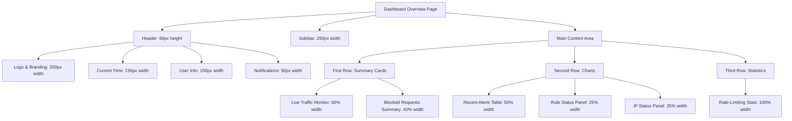
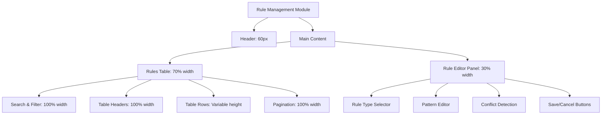
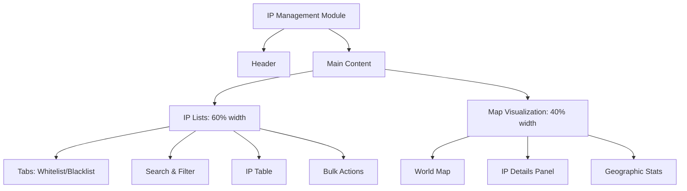
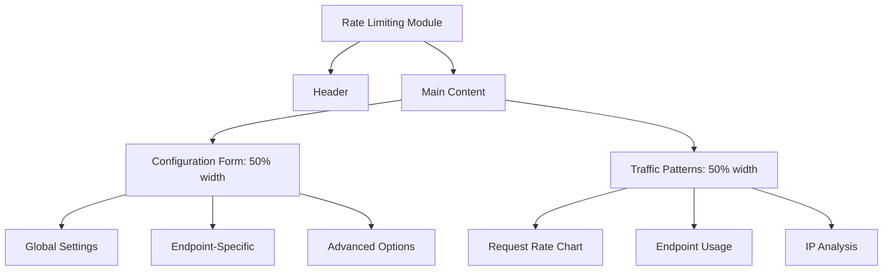
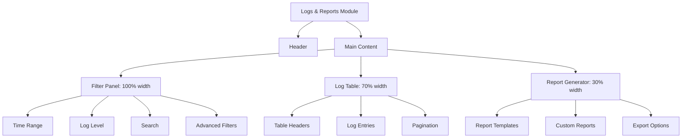

# Ariba WAF Dashboard - Comprehensive Wireframes and High-Fidelity UI Mockups

## 1. Design System Foundation

### 1.1 Color Palette (Dark Theme)
```css
/* Dark Theme Color Palette */
:root {
  --bg-primary: #121212;
  --bg-secondary: #1E1E1E;
  --bg-tertiary: #2A2A2A;
  --text-primary: #E0E0E0;
  --text-secondary: #B0B0B0;
  --text-disabled: #606060;
  --accent-blue: #4285F4;
  --accent-green: #0F9D58;
  --accent-red: #DB4437;
  --accent-yellow: #F4B400;
  --border-color: #333333;
  --hover-bg: #2D2D2D;
  --active-bg: #3A3A3A;
}
```

### 1.2 Typography
```css
/* Typography System */
font-family: 'Inter', -apple-system, BlinkMacSystemFont, 'Segoe UI', Roboto, sans-serif;
font-sizes: 12px, 14px, 16px, 18px, 20px, 24px, 28px, 32px, 36px, 48px;
line-heights: 1.2, 1.4, 1.6;
font-weights: 300, 400, 500, 600, 700;
```

### 1.3 Spacing System
```css
/* 8px Grid System */
--space-xxs: 4px;
--space-xs: 8px;
--space-sm: 12px;
--space-md: 16px;
--space-lg: 24px;
--space-xl: 32px;
--space-xxl: 48px;
--space-xxxl: 64px;
```

### 1.4 Breakpoints
```css
/* Responsive Breakpoints */
--breakpoint-tablet: 768px;
--breakpoint-desktop: 1200px;
```

## 2. Dashboard Overview Page

### 2.1 Wireframe Layout


### 2.2 High-Fidelity Mockup Specifications

#### Live Traffic Monitor Panel
```markdown
**Component**: Live Traffic Monitor
**Dimensions**: 800px × 400px
**Position**: Top-left, 60% width
**Chart Type**: Real-time line chart with gradient fill
**Data Points**: Requests per second, blocked requests, allowed requests
**Time Range**: Last 5 minutes (sliding window)
**Features**:
- Animated data updates (smooth transitions)
- Hover tooltips with exact values
- Color coding: Blue (allowed), Red (blocked), Green (challenged)
- Time axis: 1-second intervals
- Y-axis: Auto-scaling based on traffic volume
```

#### Blocked Requests Summary
```markdown
**Component**: Blocked Requests Summary
**Dimensions**: 500px × 400px
**Position**: Top-right, 40% width
**Chart Type**: Interactive pie chart
**Data Categories**: SQLi, XSS, IP Blacklist, Rate Limit, Other
**Features**:
- Legend with color coding
- Click segments to filter table data
- Center label: Total blocked requests
- Hover effects: Segment highlight + percentage
- Export button: Download as PNG/CSV
```

#### Recent Alerts Table
```markdown
**Component**: Recent Alerts Table
**Dimensions**: 600px × 300px
**Position**: Middle-left, 50% width
**Columns**: Timestamp, IP Address, Threat Type, Risk Score, Action
**Features**:
- Sortable columns (click headers)
- Pagination: 10 items per page
- Color-coded risk scores: Red (High), Yellow (Medium), Green (Low)
- Click row to view detailed alert information
- Real-time updates with fade-in animation
```

#### Rule Status Panel
```markdown
**Component**: Rule Status Panel
**Dimensions**: 300px × 300px
**Position**: Middle-center, 25% width
**Content**:
- Total Rules: 42
- Active Rules: 38
- Disabled Rules: 4
- Conflicts: 2
**Features**:
- Circular progress indicators
- Quick action buttons: Enable All, Disable All
- Conflict resolution link
- Hover effects on action buttons
```

#### IP Status Panel
```markdown
**Component**: IP Status Panel
**Dimensions**: 300px × 300px
**Position**: Middle-right, 25% width
**Content**:
- Whitelisted IPs: 15
- Blacklisted IPs: 87
- Temporary Blocks: 12
- Geographic Distribution: Top 5 countries
**Features**:
- Mini world map with heat points
- Quick add IP button
- Export IP list button
- Hover tooltips for country details
```

#### Rate-Limiting Stats Panel
```markdown
**Component**: Rate-Limiting Stats
**Dimensions**: 1200px × 200px
**Position**: Bottom, 100% width
**Content**:
- Current Rate: 125 req/s
- Rate Limit: 1000 req/s
- Blocked Requests: 15
- Top Endpoints: /api/login, /api/data, /api/search
**Features**:
- Real-time gauge chart
- Endpoint breakdown bar chart
- Time window selector: 1min/5min/15min
- Reset rate limits button
```

## 3. Sidebar Navigation

### 3.1 Wireframe Layout
```mermaid
graph TD
    A[Sidebar Navigation] --> B[Header: 60px height]
    A --> C[Navigation Items: Variable height]
    A --> D[Footer: 80px height]

    B --> B1[Logo: 40px × 40px]
    B --> B2[Brand Name: "Ariba WAF"]

    C --> C1[Dashboard: Icon + Text]
    C --> C2[Live Traffic: Icon + Text]
    C --> C3[Blocked Requests: Icon + Text]
    C --> C4[Rule Management: Icon + Text]
    C --> C5[IP Management: Icon + Text]
    C --> C6[Rate Limiting: Icon + Text]
    C --> C7[Logs & Reports: Icon + Text]
    C --> C8[Settings: Icon + Text]

    D --> D1[User Avatar: 32px × 32px]
    D --> D2[User Name: "Admin"]
    D --> D3[Logout Button]
```

### 3.2 High-Fidelity Mockup Specifications

#### Collapsible Sidebar
```markdown
**Component**: Collapsible Sidebar
**Expanded Width**: 250px
**Collapsed Width**: 60px
**Background**: var(--bg-secondary)
**Border Right**: 1px solid var(--border-color)
**Transition**: 0.3s cubic-bezier(0.4, 0, 0.2, 1)

**Features**:
- Toggle button: Hamburger menu icon
- Hover effects: Background color change
- Active state: Left border indicator (3px solid var(--accent-blue))
- Responsive behavior: Auto-collapse on tablet screens
- Keyboard navigation: Arrow keys for selection
```

#### Navigation Items
```markdown
**Item Dimensions**: 48px height, 100% width
**Padding**: 12px horizontal, 8px vertical
**Icon Size**: 20px × 20px
**Text Style**: 14px, 500 weight, var(--text-primary)
**Hover State**: Background var(--hover-bg)
**Active State**: Background var(--active-bg), left border var(--accent-blue)

**Icons**:
- Dashboard: 📊
- Live Traffic: 📈
- Blocked Requests: 🚫
- Rule Management: 🛡️
- IP Management: 🌍
- Rate Limiting: ⏱️
- Logs & Reports: 📋
- Settings: ⚙️
```

#### Responsive Behavior
```markdown
**Desktop (≥1200px)**: Always expanded
**Tablet (768px-1199px)**: Collapsed by default, expands on hover
**Mobile (<768px)**: Hidden, accessible via hamburger menu
**Transition**: Smooth slide animation (0.3s)
```

## 4. Rule Management Module

### 4.1 Wireframe Layout


### 4.2 High-Fidelity Mockup Specifications

#### Rules Table
```markdown
**Component**: Rules Table
**Dimensions**: 900px × 600px
**Columns**: Rule ID, Type, Severity, Status, Actions
**Row Height**: 48px
**Header Height**: 40px

**Features**:
- Sortable columns (click to sort)
- Multi-select checkboxes
- Color-coded severity: Red (Critical), Orange (High), Yellow (Medium), Green (Low)
- Status indicators: Green (Active), Gray (Disabled)
- Action buttons: Edit, Delete, Duplicate
- Inline editing for quick changes
- Bulk actions: Enable/Disable, Delete
```

#### Rule Editor Form
```markdown
**Component**: Rule Editor
**Dimensions**: 400px × 600px
**Sections**:
1. **Rule Type**: Dropdown selector (SQLi, XSS, IP, Rate Limit)
2. **Basic Info**: Name, Description, Severity
3. **Pattern Editor**: Multi-line text area with syntax highlighting
4. **Testing**: Input field + Test button
5. **Conflict Detection**: Visual indicator + resolution options

**Validation States**:
- Valid: Green border
- Invalid: Red border + error message
- Warning: Yellow border + warning message

**Form Controls**:
- Input fields: 40px height, 8px padding
- Buttons: 36px height, 16px padding
- Dropdowns: 40px height, chevron icon
- Text areas: 120px height, monospace font
```

#### Rule Conflict Detection
```markdown
**Component**: Conflict Detection
**Dimensions**: 400px × 200px
**Visualization**: Graph showing rule overlaps
**Features**:
- Visual conflict indicators
- Conflict resolution suggestions
- Merge conflicting rules option
- Ignore conflict checkbox
- Detailed conflict explanation
```

## 5. IP Management Module

### 5.1 Wireframe Layout


### 5.2 High-Fidelity Mockup Specifications

#### IP Lists Table
```markdown
**Component**: IP Lists Table
**Dimensions**: 800px × 500px
**Columns**: IP Address, Type, Added Date, Expiry, Actions
**Features**:
- Tabbed interface: Whitelist/Blacklist
- Search functionality: IP address, country, date range
- Bulk import: CSV upload with validation
- Bulk export: CSV/JSON formats
- Quick add: Inline form for single IP
- IP details: Click to view geographic info
```

#### Geographic Visualization
```markdown
**Component**: World Map
**Dimensions**: 600px × 500px
**Type**: Interactive SVG map
**Features**:
- Heatmap: Color intensity by attack frequency
- Clickable countries: Show IP details
- Hover tooltips: Country name, IP count
- Zoom functionality: Mouse wheel + buttons
- Legend: Color scale explanation
- Time slider: Filter by date range
```

#### IP Details Panel
```markdown
**Component**: IP Details Panel
**Dimensions**: 300px × 300px
**Content**:
- IP Address
- Country/Region
- ISP Information
- Threat History
- Last Activity
- Action Buttons: Whitelist, Blacklist, Remove
```

## 6. Rate Limiting Module

### 6.1 Wireframe Layout


### 6.2 High-Fidelity Mockup Specifications

#### Configuration Form
```markdown
**Component**: Rate Limit Configuration
**Dimensions**: 600px × 400px
**Sections**:
1. **Global Settings**:
   - Requests per second: Slider (1-1000)
   - Time window: Dropdown (1min, 5min, 15min)
   - Burst capacity: Input field
2. **Endpoint-Specific**:
   - Endpoint selector: Dropdown
   - Custom limits: Input fields
   - Method restrictions: Checkboxes
3. **Advanced Options**:
   - IP whitelist: Multi-select
   - Response headers: Text area
   - Error messages: Customizable

**Form Features**:
- Real-time validation
- Preview changes button
- Reset to defaults
- Save draft functionality
- Change history tracking
```

#### Traffic Patterns Visualization
```markdown
**Component**: Traffic Patterns
**Dimensions**: 600px × 400px
**Charts**:
1. **Request Rate**: Line chart with thresholds
2. **Endpoint Usage**: Bar chart top 10 endpoints
3. **IP Analysis**: Pie chart top requesting IPs
**Features**:
- Real-time updates (5-second refresh)
- Time range selector
- Export chart data
- Zoom functionality
- Interactive legends
```

## 7. Logs & Reports Module

### 7.1 Wireframe Layout


### 7.2 High-Fidelity Mockup Specifications

#### Advanced Filtering Interface
```markdown
**Component**: Filter Panel
**Dimensions**: 1200px × 80px
**Sections**:
1. **Time Range**: Date picker + quick selects
2. **Log Level**: Multi-select (Info, Warning, Error, Critical)
3. **Search**: Text input with autocomplete
4. **Advanced Filters**: Expandable panel
**Features**:
- Real-time filter application
- Filter chips: Visual representation
- Save filter presets
- Clear all filters button
- Filter history
```

#### Log Table
```markdown
**Component**: Log Table
**Dimensions**: 900px × 600px
**Columns**: Timestamp, Level, IP, Message, Source
**Features**:
- Virtual scrolling for performance
- Column resizing
- Multi-line message display
- Expandable rows for details
- Copy to clipboard functionality
- Export selected entries
- 50/100/500 items per page
```

#### Export Options
```markdown
**Component**: Export Manager
**Dimensions**: 300px × 200px
**Formats**: CSV, JSON, PDF, Excel
**Options**:
- Date range selection
- Column selection
- Format-specific options
- Email delivery
- Scheduled exports
**Features**:
- Export progress indicator
- Download history
- Preset configurations
- Bulk export capabilities
```

## 8. Interactive Component Specifications

### 8.1 Chart Components (Chart.js Integration)
```markdown
**Line Chart Configuration**:
```javascript
{
  type: 'line',
  data: {
    labels: ['00:00', '00:01', '00:02', ...],
    datasets: [
      {
        label: 'Allowed Requests',
        data: [120, 145, 130, ...],
        borderColor: '#4285F4',
        backgroundColor: 'rgba(66, 133, 244, 0.1)',
        tension: 0.4,
        fill: true
      },
      {
        label: 'Blocked Requests',
        data: [5, 8, 6, ...],
        borderColor: '#DB4437',
        backgroundColor: 'rgba(219, 68, 55, 0.1)',
        tension: 0.4,
        fill: true
      }
    ]
  },
  options: {
    responsive: true,
    maintainAspectRatio: false,
    interaction: {
      mode: 'index',
      intersect: false
    },
    plugins: {
      legend: { position: 'top' },
      tooltip: {
        callbacks: {
          label: function(context) {
            return context.dataset.label + ': ' + context.parsed.y;
          }
        }
      }
    },
    scales: {
      x: { grid: { display: false } },
      y: { beginAtZero: true }
    }
  }
}
```

### 8.2 Table Components
```markdown
**Sortable Table Configuration**:
```javascript
{
  columns: [
    {
      key: 'timestamp',
      label: 'Timestamp',
      sortable: true,
      width: '180px',
      formatter: (value) => formatDate(value)
    },
    {
      key: 'ip',
      label: 'IP Address',
      sortable: true,
      width: '150px'
    },
    {
      key: 'threatType',
      label: 'Threat Type',
      sortable: true,
      width: '120px',
      formatter: (value) => threatTypeLabels[value]
    }
  ],
  pagination: {
    pageSize: 10,
    pageSizes: [10, 25, 50, 100],
    currentPage: 1
  },
  features: {
    multiSelect: true,
    rowExpansion: true,
    virtualScroll: true,
    columnResizing: true
  }
}
```

### 8.3 Form Components with Validation
```markdown
**Rule Editor Form Validation**:
```javascript
{
  fields: {
    ruleName: {
      required: true,
      minLength: 3,
      maxLength: 50,
      pattern: /^[a-zA-Z0-9_\-]+$/,
      errorMessages: {
        required: 'Rule name is required',
        minLength: 'Minimum 3 characters',
        pattern: 'Only alphanumeric, underscore, and hyphen allowed'
      }
    },
    severity: {
      required: true,
      options: ['low', 'medium', 'high', 'critical'],
      errorMessages: {
        required: 'Severity level is required'
      }
    },
    patterns: {
      required: true,
      minItems: 1,
      itemPattern: /^[\s\S]{5,500}$/,
      errorMessages: {
        required: 'At least one pattern is required',
        itemPattern: 'Pattern must be 5-500 characters'
      }
    }
  },
  validationMode: 'onBlur',
  showErrors: 'touched'
}
```

## 9. Responsive Design Specifications

### 9.1 Desktop Layout (≥1200px)
```markdown
**Container**: 1200px max-width, centered
**Sidebar**: 250px fixed width, always visible
**Main Content**: calc(100% - 250px)
**Grid System**: 12 columns, 24px gutters
**Card Layouts**: 2-4 columns depending on content
**Spacing**: 24px between components
```

### 9.2 Tablet Layout (768px-1199px)
```markdown
**Container**: 100% width, 16px padding
**Sidebar**: 60px collapsed, expands to 250px on hover
**Main Content**: 100% width when sidebar collapsed
**Grid System**: 8 columns, 16px gutters
**Card Layouts**: 1-2 columns (stacked)
**Spacing**: 16px between components
**Touch Targets**: Minimum 48px × 48px
```

### 9.3 Mobile Considerations (<768px)
```markdown
**Note**: Mobile not in initial scope, but responsive considerations:
- Sidebar: Hidden behind hamburger menu
- Cards: Full width, stacked vertically
- Tables: Horizontal scroll or card-based layout
- Charts: Simplified versions
- Touch: Enhanced touch targets and gestures
```

## 10. Interactive States and Animations

### 10.1 Button States
```markdown
**Default State**:
- Background: var(--bg-tertiary)
- Text: var(--text-primary)
- Border: 1px solid var(--border-color)

**Hover State**:
- Background: var(--hover-bg)
- Transform: translateY(-1px)
- Transition: 0.2s ease

**Active State**:
- Background: var(--active-bg)
- Transform: translateY(0)
- Box-shadow: inset 0 2px 4px rgba(0,0,0,0.2)

**Disabled State**:
- Background: var(--bg-secondary)
- Text: var(--text-disabled)
- Cursor: not-allowed
- Opacity: 0.6
```

### 10.2 Card Animations
```markdown
**Hover Effects**:
- Transform: translateY(-4px)
- Box-shadow: 0 8px 16px rgba(0,0,0,0.1)
- Transition: 0.3s cubic-bezier(0.4, 0, 0.2, 1)

**Loading States**:
- Skeleton loading: Animated gradient
- Spinner: Circular progress indicator
- Fade-in: 0.3s fade when data loads

**Data Updates**:
- New data: Fade-in + slide-up (0.3s)
- Removed data: Fade-out + slide-down (0.2s)
- Chart updates: Smooth transitions (0.5s)
```

### 10.3 Navigation Transitions
```markdown
**Page Transitions**:
- Fade: 0.2s crossfade between pages
- Slide: Horizontal slide for module changes
- Route-based: Different animations per route

**Sidebar Transitions**:
- Expand/Collapse: 0.3s cubic-bezier
- Menu items: Staggered fade-in (0.1s delay)
- Icon rotation: 0.2s for chevrons
```

## 11. Accessibility Features

### 11.1 Keyboard Navigation
```markdown
**Focus Indicators**:
- Outline: 2px solid var(--accent-blue)
- Outline-offset: 2px
- Border-radius: 4px

**Keyboard Shortcuts**:
- Navigation: Arrow keys, Tab, Shift+Tab
- Actions: Enter, Space
- Modals: Escape to close
- Search: Ctrl+K (Cmd+K on Mac)
```

### 11.2 Screen Reader Support
```markdown
**ARIA Attributes**:
- aria-label: Descriptive labels
- aria-live: Real-time updates
- aria-hidden: Decorative elements
- aria-expanded: Collapsible sections

**Semantic HTML**:
- Proper heading hierarchy (h1-h6)
- Landmark roles (banner, navigation, main, aside)
- Form labels and associations
- Table structure with proper headers
```

### 11.3 Color Contrast
```markdown
**Contrast Ratios**:
- Text: Minimum 4.5:1 (WCAG AA)
- UI Components: Minimum 3:1
- Interactive Elements: Minimum 4.5:1

**Dark Theme Testing**:
- Background: #121212
- Primary Text: #E0E0E0 (15.3:1 contrast)
- Secondary Text: #B0B0B0 (9.2:1 contrast)
- Disabled Text: #606060 (3.8:1 contrast)
```

## 12. Implementation Notes

### 12.1 Chart.js Integration
```markdown
**Required Plugins**:
- chartjs-plugin-annotation (for thresholds)
- chartjs-plugin-datalabels (for data labels)
- chartjs-plugin-zoom (for zoom functionality)

**Performance Optimization**:
- Destroy charts on unmount
- Use canvas rendering for large datasets
- Implement data sampling for high-frequency updates
- Use web workers for complex calculations
```

### 12.2 Responsive Charts
```markmarkdown
**Adaptive Configuration**:
```javascript
{
  responsive: true,
  maintainAspectRatio: false,
  onResize: function(chart, size) {
    // Adjust font sizes based on container width
    const baseSize = Math.min(size.width / 100, 16);
    chart.options.plugins.legend.labels.font.size = baseSize;
    chart.options.plugins.tooltip.bodyFont.size = baseSize;
    chart.update();
  }
}
```

### 12.3 Data Visualization Best Practices
```markdown
**Chart Selection Guide**:
- **Trends over time**: Line charts
- **Comparisons**: Bar charts
- **Proportions**: Pie/donut charts
- **Distributions**: Histograms
- **Relationships**: Scatter plots
- **Geographic data**: Maps

**Color Usage**:
- Consistent color mapping across charts
- Accessible color palettes
- High contrast for important data
- Limited palette (6-8 colors max)
```

## 13. Complete Component Inventory

### 13.1 Reusable Components
```markdown
**Atomic Components**:
- Buttons (Primary, Secondary, Icon)
- Inputs (Text, Number, Password)
- Selectors (Dropdown, Multi-select)
- Checkboxes & Radio buttons
- Toggle switches
- Badges & Tags
- Tooltips & Popovers
- Modals & Dialogs
- Alerts & Notifications
- Loaders & Spinners
- Progress bars & Indicators
```

### 13.2 Composite Components
```markdown
**Molecular Components**:
- Card (with header, content, footer)
- Table (with sorting, pagination)
- Form (with validation, submission)
- Chart Container (with controls)
- Navigation Menu (with submenus)
- Filter Panel (with multiple filters)
- Search Bar (with autocomplete)
- Pagination Controls
- Export Manager
- Conflict Detector
```

### 13.3 Organismic Components
```markdown
**Organism Components**:
- Dashboard Layout (header, sidebar, main)
- Rule Management Module
- IP Management Module
- Rate Limiting Module
- Logs & Reports Module
- Live Traffic Monitor
- Blocked Requests Analyzer
- System Health Dashboard
```

## 14. Design Tokens and Variables

### 14.1 CSS Variables
```css
:root {
  /* Spacing */
  --space-unit: 8px;
  --space-xxs: calc(var(--space-unit) * 0.5);
  --space-xs: var(--space-unit);
  --space-sm: calc(var(--space-unit) * 1.5);
  --space-md: calc(var(--space-unit) * 2);
  --space-lg: calc(var(--space-unit) * 3);
  --space-xl: calc(var(--space-unit) * 4);
  --space-xxl: calc(var(--space-unit) * 6);
  --space-xxxl: calc(var(--space-unit) * 8);

  /* Border Radius */
  --radius-sm: 4px;
  --radius-md: 8px;
  --radius-lg: 12px;
  --radius-full: 9999px;

  /* Box Shadows */
  --shadow-sm: 0 1px 2px rgba(0, 0, 0, 0.1);
  --shadow-md: 0 4px 6px rgba(0, 0, 0, 0.1);
  --shadow-lg: 0 10px 15px rgba(0, 0, 0, 0.1);
  --shadow-xl: 0 20px 25px rgba(0, 0, 0, 0.1);

  /* Transitions */
  --transition-fast: 0.1s ease;
  --transition-normal: 0.2s ease;
  --transition-slow: 0.3s ease;
  --transition-cubic: cubic-bezier(0.4, 0, 0.2, 1);
}
```

### 14.2 Animation Variables
```css
:root {
  /* Animation Durations */
  --anim-fast: 0.15s;
  --anim-normal: 0.25s;
  --anim-slow: 0.4s;
  --anim-xslow: 0.6s;

  /* Animation Easing */
  --ease-in: cubic-bezier(0.4, 0, 1, 1);
  --ease-out: cubic-bezier(0, 0, 0.2, 1);
  --ease-in-out: cubic-bezier(0.4, 0, 0.2, 1);
  --ease-elastic: cubic-bezier(0.68, -0.55, 0.265, 1.55);

  /* Animation Delays */
  --delay-sm: 0.05s;
  --delay-md: 0.1s;
  --delay-lg: 0.2s;
}
```

## 15. Implementation Checklist

### 15.1 Development Phases
```markdown
**Phase 1: Foundation**
- [ ] Set up design system variables
- [ ] Create base components (buttons, inputs, cards)
- [ ] Implement responsive grid system
- [ ] Set up theme switching
- [ ] Create layout components (header, sidebar, footer)

**Phase 2: Core Modules**
- [ ] Dashboard Overview page
- [ ] Live Traffic monitoring
- [ ] Blocked Requests analysis
- [ ] Rule Management interface
- [ ] IP Management with maps

**Phase 3: Advanced Features**
- [ ] Rate Limiting configuration
- [ ] Logs & Reports with filtering
- [ ] Settings and user management
- [ ] Real-time WebSocket integration
- [ ] Chart.js implementation

**Phase 4: Polish & Optimization**
- [ ] Accessibility testing
- [ ] Performance optimization
- [ ] Cross-browser testing
- [ ] Responsive testing
- [ ] User testing and feedback
```

### 15.2 Quality Assurance Checklist
```markdown
**Visual Design**:
- [ ] Consistent spacing and alignment
- [ ] Proper color contrast ratios
- [ ] Correct typography hierarchy
- [ ] Consistent component sizing
- [ ] Proper icon usage

**Functionality**:
- [ ] All interactive elements work
- [ ] Form validation implemented
- [ ] Error states handled
- [ ] Loading states implemented
- [ ] Empty states designed

**Responsive Design**:
- [ ] Desktop layout functional
- [ ] Tablet layout functional
- [ ] Mobile considerations addressed
- [ ] Touch targets appropriate
- [ ] Breakpoints working correctly

**Performance**:
- [ ] Charts optimized for performance
- [ ] Virtual scrolling for large datasets
- [ ] Lazy loading implemented
- [ ] Image optimization
- [ ] Bundle size optimized
```

## 16. Final Deliverables Summary

### 16.1 Wireframe Documents
- **Dashboard Overview Page**: Complete layout with all panels
- **Sidebar Navigation**: Collapsible design with all menu items
- **Rule Management Module**: Table, editor, and conflict detection
- **IP Management Module**: Lists, maps, and geographic visualization
- **Rate Limiting Module**: Configuration forms and traffic patterns
- **Logs & Reports Module**: Advanced filtering and export options

### 16.2 High-Fidelity Mockup Specifications
- **Exact Dimensions**: Pixel-perfect measurements for all components
- **Color Schemes**: Dark theme with accent colors defined
- **Typography**: Font sizes, weights, and line heights specified
- **Interactive States**: Hover, active, disabled states documented
- **Data Visualization**: Chart configurations and examples
- **Form Layouts**: Validation states and error handling
- **Responsive Layouts**: Desktop and tablet specifications

### 16.3 Technical Implementation Guide
- **Chart.js Integration**: Configuration examples and best practices
- **Component Inventory**: Complete list of reusable components
- **Design Tokens**: CSS variables for consistent theming
- **Animation Specifications**: Transition durations and easing functions
- **Accessibility Features**: Keyboard navigation and screen reader support
- **Quality Assurance**: Testing checklist and validation criteria

This comprehensive document provides all necessary specifications for implementing the Ariba WAF dashboard UI with precise wireframes and high-fidelity mockup details.